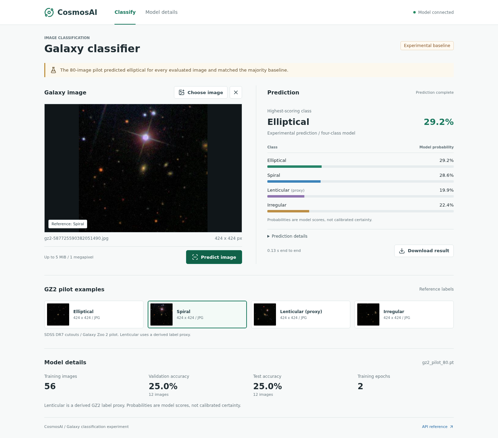

# CosmosAI Inference Platform

CosmosAI is a **learning-first astronomy and machine learning project**. It follows
the path from image pixels and neural-network calculations to a working model
API and browser application.

The goal is to understand both sides: **how a model learns** and **how to build
software around that model**. The project combines a galaxy classifier, an
interactive CNN learning replay, concept notes and diagrams. It is also a
portfolio project, developed incrementally with measured results and explicit
limitations rather than claims of production readiness.

## Current State

- **Working locally:** upload a galaxy JPEG/PNG, run a saved PyTorch model, inspect
  all four class probabilities and download the prediction as JSON.
- **Learning site:** recorded CNN calculations, searchable concept explanations
  and linked Excalidraw diagrams, served alongside the classifier.
- **Training pipeline:** dataset preparation, validation, training, evaluation
  and checkpoint save/load are implemented separately from the web application.
- **Deployment preparation:** a portable three-service Docker release has been
  tested locally. There is **no public demo URL yet**; Google Cloud Run is the
  proposed hosting target, not a completed deployment.

**Model limitation:** the bundled model is an experimental baseline trained on
56 images from an 80-image Galaxy Zoo 2 pilot. It scored **25% on validation and
25% on test** (3/12 each), predicting elliptical for every evaluated image.
The application demonstrates real inference, but it is **not yet a reliable
galaxy classifier**. Improving model quality is a separate milestone from making
the application usable. See the [checkpoint notes](data/demo/README.md).



## Application And Learning Pages

All pages share the same local web application and navigation.

| Page | Route | What it contains |
| --- | --- | --- |
| Galaxy Classifier | `/` | Image upload and preview, four sample galaxies, probabilities, model details and JSON results. |
| CNN Learning Replay | `/learn/` | Step-by-step RGB convolution, ReLU, pooling, matrix multiplication, loss, gradients and SGD weight updates. |
| Concepts Explanations | `/learn/concepts/` | 67 topics from the project's Markdown learning notes, with search and links to individual concepts. |
| Diagrams | `/learn/diagrams/` | 28 Excalidraw diagrams published as zoomable SVGs, with related concepts and source downloads. |

The replay is a **recorded, small teaching run**, not an explanation of the image
currently uploaded to the classifier. Its controls inspect recorded values;
they do not train a model. Links connect the calculations to the concept pages
and preserve the replay selection when returning in the same browser tab.

The learning pages are prebuilt static content served by the gateway, not
additional prediction services. See the [learning content guide](apps/learning-content/README.md)
for authoring and rebuilding the Markdown and diagram exports.

## Services

| Service | Responsibility | Status |
| --- | --- | --- |
| [API Gateway](apps/api-gateway/main.py) | Serves the UI and learning pages; accepts image uploads and forwards prediction requests. | Running in the local demo. |
| [Inference Router](apps/inference-router/main.py) | Forwards galaxy requests to the classifier and provides a routing boundary for future model services. | Running in the local demo. |
| [Galaxy Classifier](apps/galaxy-classifier-service/main.py) | Loads the saved checkpoint, preprocesses images and returns logits and probabilities for elliptical, spiral, lenticular and irregular. | Real inference; experimental model. |
| [Stellar Classifier](apps/stellar-classifier-service/main.py) | API scaffold for future classification from stellar spectra or features. | Stub only; no trained model or UI. Not started by the demo launcher. |

An astronomy question-answering assistant with retrieved sources is planned;
there is no implemented RAG service yet.

## Architecture

### Browser And Prediction

```text
Browser
  |
  v
API Gateway
  |-- Classifier UI + Replay + Concepts + Diagrams
  |
  `-- Image upload --> Inference Router --> Galaxy Classifier
                                             |
                                             v
                                Shared preprocessing + saved CNN
                                             |
                                             v
                                Class scores and probabilities
                                (returned through the same APIs)
```

`POST /classify/image` runs prediction. `GET /model` reports the active model's
details. **Uploading an image never trains the model or changes its weights.**
JPEG/PNG uploads are limited to 5 MiB and 1,048,576 pixels; temporary uploads are
removed after prediction. Non-galaxy images still receive a class because the
current model has no "unknown" category.

### Data And Training

```text
Galaxy Zoo metadata + source images
  -> prepare_galaxy_zoo_subset.py
  -> selected image files + CSV manifest (labels and train/val/test splits)
  -> train_galaxy_cnn_baseline.py
  -> evaluation reports + saved checkpoint (weights and preprocessing policy)
  -> classifier service or predict_galaxy_checkpoint.py
```

These are **separate execution steps connected by files**: preparation writes
the dataset that training later reads. The preparation script does not call the
training script or train a model. Training and prediction reuse the Python
package in [`cosmosai/galaxy/`](cosmosai/galaxy).

### Main Objects And Files

| Object or entry point | Role |
| --- | --- |
| [`GalaxyManifestRecord`](cosmosai/galaxy/manifest.py) | Describes one image, its label, file location and dataset split. |
| [`GalaxyPreprocessingPolicy`](cosmosai/galaxy/preprocessing.py) | Defines the RGB, resizing and normalization contract saved with the checkpoint. |
| [`GalaxyTorchDataset`](cosmosai/galaxy/torch_dataset.py) | Loads training images lazily for PyTorch batches. |
| [`TinyGalaxyCNN`](cosmosai/galaxy/model.py) | The small convolution, ReLU, pooling and linear classification model; this module also saves and loads checkpoints. |
| [`predict_image_from_checkpoint()`](cosmosai/galaxy/checkpoint_inference.py) | Shared image prediction function used by the CLI and classifier API. |
| [`prepare_galaxy_zoo_subset.py`](scripts/prepare_galaxy_zoo_subset.py) / [`train_galaxy_cnn_baseline.py`](scripts/train_galaxy_cnn_baseline.py) | Prepare a labeled dataset, then train and evaluate a model in a separate run. |
| [`observe_galaxy_weight_updates.py`](scripts/observe_galaxy_weight_updates.py) / [`build_learning_replay.py`](scripts/build_learning_replay.py) | Record a bounded teaching run and build its HTML replay. |
| [`build_learning_site.py`](scripts/build_learning_site.py) / [`export_learning_diagrams.cjs`](scripts/export_learning_diagrams.cjs) | Publish the concept notes and Excalidraw illustrations as web pages and SVGs. |
| [`run_local_demo.py`](scripts/run_local_demo.py) | Start and stop the three local inference services together. |

The browser assets live in [`apps/api-gateway/static/`](apps/api-gateway/static),
the replay in [`apps/learning-replay/`](apps/learning-replay), and the published
learning content in [`apps/learning-content/site/`](apps/learning-content/site).
The small demo checkpoint and sample images live under [`data/`](data).

## Tech Stack

| Area | Used Now |
| --- | --- |
| APIs | Python, FastAPI, Pydantic, Uvicorn and Requests for service-to-service HTTP. |
| Machine learning | CPU PyTorch, NumPy and Pillow for image loading and preprocessing. |
| Browser UI | HTML, CSS and vanilla JavaScript, with locally bundled Lucide icons. |
| Learning content | Markdown, Jinja2, markdown-it-py and Excalidraw SVG exports. Node.js and Playwright are used for diagram export and browser checks. |
| Packaging | Docker and Docker Compose. |
| Verification | pytest, HTTP smoke checks and desktop/mobile browser checks. |

Cloud hosting, RAG, experiment tracking and production monitoring are future
work, not already-installed capabilities of the current application.

## Run Locally

### Python

Tested on Linux with Python 3.10. From the repository root:

```bash
python3 -m venv .venv
.venv/bin/python -m pip install -r requirements.txt
.venv/bin/python scripts/run_local_demo.py --checkpoint data/demo/gz2_pilot_80.pt
```

Open **http://127.0.0.1:8080**. Choose a bundled GZ2 example or upload a JPEG/PNG,
then select **Predict image**. The other pages are available in the navigation.

The launcher starts all three services on localhost. **Ctrl+C** stops them;
append `--port 8085` to the launch command if port 8080 is occupied.
The demo uses the bundled checkpoint: no GPU, external data drive, full training
dataset, cloud account or Node.js installation is needed to run it.

### Docker

With Docker Engine and Compose installed:

```bash
docker compose -p cosmosai-release -f docker-compose.release.yml up -d --build --wait
```

Open **http://127.0.0.1:8090**. This release packages the checkpoint, examples and
learning pages inside the images without external drive mounts. The first build
downloads dependencies and can take several minutes; it does not train a model.

Stop it with:

```bash
docker compose -p cosmosai-release -f docker-compose.release.yml down
```

See the [deployment guide](deploy/README.md) for resource limits, smoke checks
and the remaining public-hosting checklist. These localhost URLs are not public
demo links.

## Tests

After installing the main requirements:

```bash
.venv/bin/python -m pip install -r requirements-dev.txt -r requirements-learning.txt
OMP_NUM_THREADS=2 MKL_NUM_THREADS=2 .venv/bin/python -m pytest -q tests
```

Coverage includes dataset contracts, preprocessing, training and checkpoint
behavior, upload/API handling, and learning content. Browser checks are described
in the [learning content guide](apps/learning-content/README.md).

## Next Milestones

1. **Public reviewer demo:** select a hosting account and budget, deploy the
   packaged application over HTTPS, add access or abuse controls, and verify the
   public URL before publishing it here. Google Cloud Run is the proposed target.
2. **Better galaxy predictions:** review labels, test a stronger small model,
   expand the balanced dataset and measure validation performance before
   replacing the serving checkpoint. More data alone is not proof of improvement.
3. **Astronomy assistant:** add a separate retrieval-augmented question-answering
   service with cited sources and its own UI.
4. **Serving and learning improvements:** measure latency and resource use,
   add experiment tracking and monitoring, and extend the replay to real-data
   tensor shapes while keeping concepts separate from worked calculations.
5. **Stellar classification:** replace the stub with a trained, evaluated model
   and a suitable input page for stellar data.

The aim is a usable, understandable portfolio application first, with model
quality and infrastructure improved through evidence rather than extra tooling.
