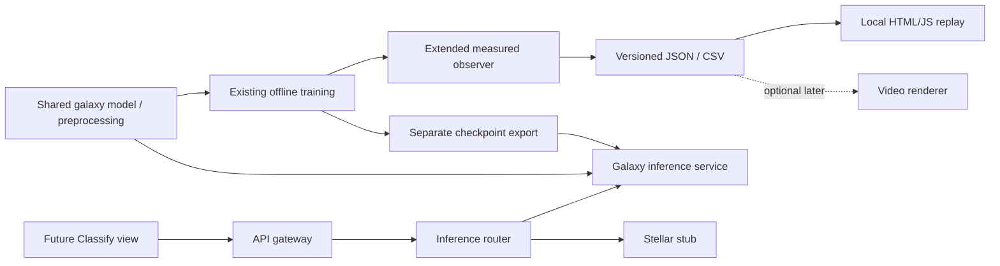
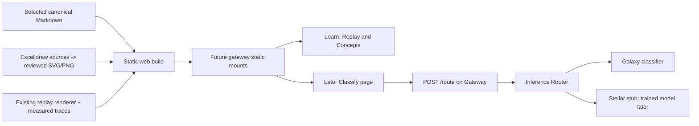

# Architecture

CosmosAI is designed as a small AI inference platform using astronomy as the domain.

The numbered steps describe what was implemented and verified. The explicitly labeled planned extension records the approved next architecture, not running software. Future roadmap items live in [portfolio_ai_project_plan_ultimate.md](portfolio_ai_project_plan_ultimate.md), and master's-course reuse ideas live in [master_project_integration.md](master_project_integration.md).

Start with [current_status.md](current_status.md). The numbered steps below are historical increments: later steps supersede earlier runtime details. **Step 20 / Milestone 50** adds the data-quality gate and **Step 21 / Milestone 51** moves model-ready image loading into Dataset access; the first usable galaxy release is still in progress.

## Cuprins

- [[#Step 0: Local Service Skeleton And Mock Routing|Step 0: Local Service Skeleton And Mock Routing]]
- [[#Step 1: Galaxy Data Intake Proof|Step 1: Galaxy Data Intake Proof]]
- [[#Step 2: Tiny Model-Ready Dataset Proof|Step 2: Tiny Model-Ready Dataset Proof]]
- [[#Step 3: CNN Baseline Training Skeleton|Step 3: CNN Baseline Training Skeleton]]
- [[#Step 4: PyTorch CNN Forward Pass Proof|Step 4: PyTorch CNN Forward Pass Proof]]
- [[#Step 5: Tiny PyTorch Weight Update Proof|Step 5: Tiny PyTorch Weight Update Proof]]
- [[#Step 6: Tiny PyTorch Training Loop Proof|Step 6: Tiny PyTorch Training Loop Proof]]
- [[#Step 7: Tiny PyTorch Evaluation Proof|Step 7: Tiny PyTorch Evaluation Proof]]
- [[#Step 8: Tiny PyTorch Checkpoint Save/Load Proof|Step 8: Tiny PyTorch Checkpoint Save/Load Proof]]
- [[#Step 9: Tiny Checkpoint Inference Proof|Step 9: Tiny Checkpoint Inference Proof]]
- [[#Step 10: Optional Galaxy Service Checkpoint Inference|Step 10: Optional Galaxy Service Checkpoint Inference]]
- [[#Step 11: Optional Docker Checkpoint Compose Path|Step 11: Optional Docker Checkpoint Compose Path]]
- [[#Step 12: Shared Galaxy Runtime Package|Step 12: Shared Galaxy Runtime Package]]
- [[#Step 13: Shared Galaxy Package Review Checkpoint|Step 13: Shared Galaxy Package Review Checkpoint]]
- [[#Step 14: Tiny Split Coverage Dataset|Step 14: Tiny Split Coverage Dataset]]
- [[#Step 15: Tiny PyTorch Batch Training Proof|Step 15: Tiny PyTorch Batch Training Proof]]
- [[#Step 16: Pillow Real Image Loading Proof|Step 16: Pillow Real Image Loading Proof]]
- [[#Step 17: Tiny PyTorch Dataset And DataLoader Proof|Step 17: Tiny PyTorch Dataset And DataLoader Proof]]
- [[#Step 18: DataLoader-Driven Training|Step 18: DataLoader-Driven Training]]
- [[#Step 19: Checkpoint Preprocessing Contract|Step 19: Checkpoint Preprocessing Contract]]
- [[#Step 20: Manifest And Dataset Quality Gate (Milestone 50)|Step 20: Manifest And Dataset Quality Gate (Milestone 50)]]
- [[#Step 21: Lazy Image Loading (Milestone 51)|Step 21: Lazy Image Loading (Milestone 51)]]
- [[#Planned Extension: CNN Learning Replay|Planned Extension: CNN Learning Replay]]
- [[#High-level architecture|High-level architecture]]
- [[#Main services|Main services]]
- [[#Infrastructure layer|Infrastructure layer]]
- [[#Build principle|Build principle]]

## Step 0: Local Service Skeleton And Mock Routing

Step 0 is the foundation built through milestones 1-13. It gives us the local service layout, Docker containers, health checks, and mocked routing between services.

At this stage, routing works, but the classifiers are still stubs. That means the API flow is real HTTP between services, while the classification results are placeholder responses.

### Step 0 API flow

Code touchpoints: [api-gateway route()](vscode://file/home/h1dr0/cosmosai-platform/apps/api-gateway/main.py:67) receives the public request, [inference-router route()](vscode://file/home/h1dr0/cosmosai-platform/apps/inference-router/main.py:70) chooses the downstream service, then either [galaxy classify()](vscode://file/home/h1dr0/cosmosai-platform/apps/galaxy-classifier-service/main.py:166:1) or [stellar classify()](vscode://file/home/h1dr0/cosmosai-platform/apps/stellar-classifier-service/main.py:48) returns a response.

```text
User or client
    |
    | POST http://127.0.0.1:8000/route
    v
api-gateway container
    |
    | forwards request to:
    | http://inference-router:8000/route
    v
inference-router container
    |
    | if input_type == "galaxy_image"
    | calls http://galaxy-classifier-service:8000/classify
    |
    | if input_type == "stellar_spectrum"
    | calls http://stellar-classifier-service:8000/classify
    v
mock classifier service
    |
    | returns stub classification result
    v
inference-router
    |
    | returns selected service + classification result
    v
api-gateway
    |
    | returns final API response to the user
    v
User or client
```

### Step 0 Docker Compose infrastructure

Docker wiring is defined in [docker-compose.yml](vscode://file/home/h1dr0/cosmosai-platform/docker-compose.yml:1), with [api-gateway](vscode://file/home/h1dr0/cosmosai-platform/docker-compose.yml:4), [inference-router](vscode://file/home/h1dr0/cosmosai-platform/docker-compose.yml:20), [galaxy-classifier-service](vscode://file/home/h1dr0/cosmosai-platform/docker-compose.yml:36), and [stellar-classifier-service](vscode://file/home/h1dr0/cosmosai-platform/docker-compose.yml:52).

```text
Host machine
    |
    | published ports
    |
    | 127.0.0.1:8000 -> api-gateway:8000
    | 127.0.0.1:8001 -> inference-router:8000
    | 127.0.0.1:8002 -> galaxy-classifier-service:8000
    | 127.0.0.1:8003 -> stellar-classifier-service:8000
    v
Docker Compose network
    |
    +-- api-gateway
    |       internal URL: http://api-gateway:8000
    |
    +-- inference-router
    |       internal URL: http://inference-router:8000
    |
    +-- galaxy-classifier-service
    |       internal URL: http://galaxy-classifier-service:8000
    |
    +-- stellar-classifier-service
            internal URL: http://stellar-classifier-service:8000
```

### Step 0 service discovery rule

Inside Docker Compose, each service name becomes a private hostname. That is why [api-gateway](vscode://file/home/h1dr0/cosmosai-platform/docker-compose.yml:4) can call `http://inference-router:8000/route`: Docker Compose resolves [inference-router](vscode://file/home/h1dr0/cosmosai-platform/docker-compose.yml:20) to the inference-router container.

From the host machine, use the published localhost ports. From one container to another container, use the Compose service name and the internal container port.

### Step 0 code connection

The [API Gateway route()](vscode://file/home/h1dr0/cosmosai-platform/apps/api-gateway/main.py:67) does not import the [inference-router route()](vscode://file/home/h1dr0/cosmosai-platform/apps/inference-router/main.py:70) Python function. These are separate FastAPI apps, so they connect by HTTP.

The gateway uses [INFERENCE_ROUTER_URL](vscode://file/home/h1dr0/cosmosai-platform/apps/api-gateway/main.py:22), which points to the Docker Compose hostname for the router.

```text
apps/api-gateway/main.py
    INFERENCE_ROUTER_URL = "http://inference-router:8000/route"
    requests.post(INFERENCE_ROUTER_URL, json=request.model_dump(), timeout=5)

matches this endpoint:

apps/inference-router/main.py
    @app.post("/route")
    def route(request: RouteRequest) -> RouteResponse:
```

The connection is:

```text
URL host: inference-router
    -> Docker Compose service name
    -> inference-router container

URL port: 8000
    -> internal port used by the FastAPI app inside that container

URL path: /route
    -> FastAPI endpoint registered with @app.post("/route")
```

### Step 0 Clickable Code References

Use these links to jump from the architecture overview into the code. They use `vscode://file/...` links because this Obsidian vault is rooted at `docs/`, while the code files live outside the vault.

Service wiring:

- [docker-compose.yml](vscode://file/home/h1dr0/cosmosai-platform/docker-compose.yml:1): defines the Step 0 services and host ports.
- [api-gateway service](vscode://file/home/h1dr0/cosmosai-platform/docker-compose.yml:4): exposes the public API on host port 8000.
- [inference-router service](vscode://file/home/h1dr0/cosmosai-platform/docker-compose.yml:20): exposes the router on host port 8001.
- [galaxy-classifier-service service](vscode://file/home/h1dr0/cosmosai-platform/docker-compose.yml:36): exposes the galaxy stub on host port 8002.
- [stellar-classifier-service service](vscode://file/home/h1dr0/cosmosai-platform/docker-compose.yml:52): exposes the stellar stub on host port 8003.

API Gateway:

- [apps/api-gateway/main.py](vscode://file/home/h1dr0/cosmosai-platform/apps/api-gateway/main.py:1): public FastAPI app.
- [INFERENCE_ROUTER_URL](vscode://file/home/h1dr0/cosmosai-platform/apps/api-gateway/main.py:22): internal Docker Compose URL for the inference-router.
- [RouteRequest](vscode://file/home/h1dr0/cosmosai-platform/apps/api-gateway/main.py:26): request body accepted by `POST /route`.
- [RouteResponse](vscode://file/home/h1dr0/cosmosai-platform/apps/api-gateway/main.py:40): response body returned by `POST /route`.
- [health()](vscode://file/home/h1dr0/cosmosai-platform/apps/api-gateway/main.py:59): `GET /health` endpoint.
- [route()](vscode://file/home/h1dr0/cosmosai-platform/apps/api-gateway/main.py:67): forwards `POST /route` to inference-router.

Inference Router:

- [apps/inference-router/main.py](vscode://file/home/h1dr0/cosmosai-platform/apps/inference-router/main.py:1): routing FastAPI app.
- [GALAXY_CLASSIFIER_URL](vscode://file/home/h1dr0/cosmosai-platform/apps/inference-router/main.py:14): internal URL for the galaxy classifier stub.
- [STELLAR_CLASSIFIER_URL](vscode://file/home/h1dr0/cosmosai-platform/apps/inference-router/main.py:17): internal URL for the stellar classifier stub.
- [SERVICE_BY_INPUT_TYPE](vscode://file/home/h1dr0/cosmosai-platform/apps/inference-router/main.py:22): maps input types to service names.
- [health()](vscode://file/home/h1dr0/cosmosai-platform/apps/inference-router/main.py:62): `GET /health` endpoint.
- [route()](vscode://file/home/h1dr0/cosmosai-platform/apps/inference-router/main.py:70): chooses the downstream classifier service.

Classifier stubs:

- [apps/galaxy-classifier-service/main.py](vscode://file/home/h1dr0/cosmosai-platform/apps/galaxy-classifier-service/main.py:1): galaxy classifier FastAPI stub.
- [galaxy health()](vscode://file/home/h1dr0/cosmosai-platform/apps/galaxy-classifier-service/main.py:158:1): galaxy `GET /health` endpoint.
- [galaxy classify()](vscode://file/home/h1dr0/cosmosai-platform/apps/galaxy-classifier-service/main.py:166:1): galaxy `POST /classify` endpoint.
- [apps/stellar-classifier-service/main.py](vscode://file/home/h1dr0/cosmosai-platform/apps/stellar-classifier-service/main.py:1): stellar classifier FastAPI stub.
- [stellar health()](vscode://file/home/h1dr0/cosmosai-platform/apps/stellar-classifier-service/main.py:40): stellar `GET /health` endpoint.
- [stellar classify()](vscode://file/home/h1dr0/cosmosai-platform/apps/stellar-classifier-service/main.py:48): stellar `POST /classify` stub.

## Step 1: Galaxy Data Intake Proof

Step 1 covers milestones 17-22. This step does not train a CNN and does not use the real Galaxy Zoo dataset yet.

The goal is to prove the first local data path:

Code touchpoints: [validate_manifest()](vscode://file/home/h1dr0/cosmosai-platform/cosmosai/galaxy/manifest.py:58:1) checks the CSV contract, [load_manifest()](vscode://file/home/h1dr0/cosmosai-platform/cosmosai/galaxy/manifest.py:227:1) creates [GalaxyManifestRecord](vscode://file/home/h1dr0/cosmosai-platform/cosmosai/galaxy/manifest.py:36:1) objects, [resolve_image_path()](vscode://file/home/h1dr0/cosmosai-platform/cosmosai/galaxy/manifest.py:186:1) resolves image paths, and [load_image_for_record()](vscode://file/home/h1dr0/cosmosai-platform/cosmosai/galaxy/image_loader.py:205:1) loads the tiny image into a [GalaxyImage](vscode://file/home/h1dr0/cosmosai-platform/cosmosai/galaxy/image_loader.py:22:1) object.

```text
sample manifest CSV
  -> validate CSV contract
  -> load rows into Python records
  -> resolve image paths
  -> optionally check image existence
  -> load one tiny sample image
```

This is not full preprocessing yet. It is a small proof that the project can move from dataset metadata toward image pixels in a controlled way.

### Step 1 Files

Step 1 files: [sample manifest CSV](vscode://file/home/h1dr0/cosmosai-platform/data/samples/galaxy_manifest_sample.csv:1), [tiny PPM image](vscode://file/home/h1dr0/cosmosai-platform/data/samples/images/processed/images_224/gz2-000001.ppm:1), [validator script](vscode://file/home/h1dr0/cosmosai-platform/scripts/validate_galaxy_manifest.py:1), [manifest loader script](vscode://file/home/h1dr0/cosmosai-platform/scripts/load_galaxy_manifest.py:1), and [image loader script](vscode://file/home/h1dr0/cosmosai-platform/scripts/load_galaxy_image.py:1).

```text
data/samples/galaxy_manifest_sample.csv
  tiny sample manifest with image_id, image_path, label, split, source

data/samples/images/processed/images_224/gz2-000001.ppm
  tiny local image used only for image-loading proof

scripts/validate_galaxy_manifest.py
  checks manifest columns, labels, splits, duplicates, and empty values

scripts/load_galaxy_manifest.py
  validates the manifest, loads rows into GalaxyManifestRecord objects,
  groups rows by split, resolves paths, and can check missing images

scripts/load_galaxy_image.py
  loads one tiny PPM image from a manifest record and reports dimensions
```

### Step 1 Data Contract Flow

The validator starts at [validate_manifest()](vscode://file/home/h1dr0/cosmosai-platform/cosmosai/galaxy/manifest.py:58:1), using [REQUIRED_COLUMNS](vscode://file/home/h1dr0/cosmosai-platform/cosmosai/galaxy/manifest.py:22:1), [ALLOWED_LABELS](vscode://file/home/h1dr0/cosmosai-platform/cosmosai/galaxy/labels.py:18:1), and [ALLOWED_SPLITS](vscode://file/home/h1dr0/cosmosai-platform/cosmosai/galaxy/labels.py:21:1).

```text
galaxy_manifest_sample.csv
    |
    | read by csv.DictReader
    v
validate_galaxy_manifest.py
    |
    | checks required columns:
    | image_id, image_path, label, split, source
    |
    | checks allowed labels:
    | elliptical, spiral, lenticular, irregular
    |
    | checks allowed splits:
    | train, val, test
    v
valid manifest contract
```

### Step 1 Python Object Flow

The manifest loader uses [load_manifest()](vscode://file/home/h1dr0/cosmosai-platform/cosmosai/galaxy/manifest.py:227:1) to turn CSV rows into [GalaxyManifestRecord](vscode://file/home/h1dr0/cosmosai-platform/cosmosai/galaxy/manifest.py:36:1) objects.

```text
validated manifest CSV row
    |
    v
load_galaxy_manifest.py
    |
    | creates:
    v
GalaxyManifestRecord
    |
    | image_id = "gz2-000001"
    | image_path = "processed/images_224/gz2-000001.ppm"
    | label = "spiral"
    | split = "train"
    | source = "galaxy_zoo_2"
    v
structured Python object for future training code
```

### Step 1 Image Path Resolution Flow

Path logic lives in [resolve_image_path()](vscode://file/home/h1dr0/cosmosai-platform/cosmosai/galaxy/manifest.py:186:1), [resolved_image_paths_by_id()](vscode://file/home/h1dr0/cosmosai-platform/cosmosai/galaxy/manifest.py:199:1), and [missing_image_paths()](vscode://file/home/h1dr0/cosmosai-platform/cosmosai/galaxy/manifest.py:211:1).

```text
galaxy data root
    |
    | data/samples/images
    |
    + manifest image_path
      processed/images_224/gz2-000001.ppm
    |
    v
resolved image path
    |
    | data/samples/images/processed/images_224/gz2-000001.ppm
    v
optional existence check
```

Path resolution means turning a manifest-relative path into a full usable filesystem path. It is not duplicate detection. Duplicate `image_id` values are checked by the validator.

### Step 1 Tiny Image Loading Flow

Image-loading logic lives in [read_ppm_tokens()](vscode://file/home/h1dr0/cosmosai-platform/scripts/load_galaxy_image.py:45), [load_ppm_image()](vscode://file/home/h1dr0/cosmosai-platform/scripts/load_galaxy_image.py:64), and [load_image_for_record()](vscode://file/home/h1dr0/cosmosai-platform/scripts/load_galaxy_image.py:106).

```text
GalaxyManifestRecord
    |
    | resolve image_path against galaxy data root
    v
data/samples/images/processed/images_224/gz2-000001.ppm
    |
    | load PPM text tokens
    v
GalaxyImage
    |
    | width = 3
    | height = 3
    | channels = 3
    | pixel_values = 27
    v
proof that manifest metadata can reach image pixel values
```

The tiny image is a plain-text PPM file so this proof can run without image libraries. Step 16 adds normal PNG/JPG loading with Pillow while keeping this readable PPM fixture path.

### Step 1 Code Flow Diagram

The detailed function flow, command examples, helper notes, and path examples are in [manifest_tooling_code_flow.excalidraw](excalidraw/manifest_tooling_code_flow.excalidraw). The architecture page stays high-level; the diagram is for reading the code flow.

The diagram has clickable links to the same scripts/functions.

### Step 1 PPM Token Note

The tiny sample image uses plain-text PPM `P3` format. Here, a token just means one whitespace-separated piece from that image file, such as `P3`, `3`, `255`, or an RGB value.

Example:

```text
P3
3 3
255
0 0 0  64 64 64  255 255 255
```

This is not the same as GPT/tokenizer tokens. Future JPEG/PNG loading will probably use an image library to decode pixels directly:

```text
JPEG/PNG file
  -> image library
  -> RGB pixel numbers
```

### Step 1 Test Coverage

```text
tests/test_galaxy_manifest_validator.py
  validates the sample manifest
  rejects invalid labels
  rejects invalid split values

tests/test_galaxy_manifest_loader.py
  loads records
  groups train / val / test splits
  resolves relative and absolute image paths
  reports missing image files

tests/test_galaxy_image_loader.py
  loads the tiny sample image through a manifest record
  verifies width, height, channels, and pixel value count
  fails clearly for missing image files
```

### Step 1 Boundary

Step 1 proves:

```text
CSV metadata can be validated
CSV rows can become Python objects
relative image paths can become full paths
missing images can be reported
one tiny image can be loaded from a manifest row
```

Step 1 does not do:

```text
real dataset download
real image preprocessing
tensor conversion
CNN architecture
model training
model serving
```

## Step 2: Tiny Model-Ready Dataset Proof

Step 2 covers milestones 24-28. It extends Step 1 from "we can load one tiny image" to "we can create model-ready sample objects grouped by dataset split."

This still does not train a CNN and still does not use the real full Galaxy Zoo dataset. The current purpose is to prove the local data pipeline shape before adding ML training code.

Code touchpoints: [preprocess_image()](vscode://file/home/h1dr0/cosmosai-platform/scripts/preprocess_galaxy_image.py:49) converts [GalaxyImage](vscode://file/home/h1dr0/cosmosai-platform/scripts/load_galaxy_image.py:27) pixels into [GalaxyImageTensor](vscode://file/home/h1dr0/cosmosai-platform/scripts/preprocess_galaxy_image.py:26), [create_training_sample_for_record()](vscode://file/home/h1dr0/cosmosai-platform/scripts/create_galaxy_training_sample.py:67) creates [GalaxyTrainingSample](vscode://file/home/h1dr0/cosmosai-platform/scripts/create_galaxy_training_sample.py:38), and [create_dataset_splits()](vscode://file/home/h1dr0/cosmosai-platform/scripts/load_galaxy_dataset_splits.py:48) creates [GalaxyDatasetSplits](vscode://file/home/h1dr0/cosmosai-platform/scripts/load_galaxy_dataset_splits.py:29).

```text
validated manifest rows
  -> load tiny image pixels
  -> normalize pixels to 0.0-1.0 values
  -> attach known label and numeric label_id
  -> group samples into train, val, and test buckets
```

### Step 2 Files

Step 2 files: [preprocessor script](vscode://file/home/h1dr0/cosmosai-platform/scripts/preprocess_galaxy_image.py:1), [training sample script](vscode://file/home/h1dr0/cosmosai-platform/scripts/create_galaxy_training_sample.py:1), [dataset split loader script](vscode://file/home/h1dr0/cosmosai-platform/scripts/load_galaxy_dataset_splits.py:1), [training sample tests](vscode://file/home/h1dr0/cosmosai-platform/tests/test_galaxy_training_sample.py:1), and [dataset split tests](vscode://file/home/h1dr0/cosmosai-platform/tests/test_galaxy_dataset_splits.py:1).

```text
scripts/preprocess_galaxy_image.py
  turns raw RGB pixel values into normalized model-ready numbers

scripts/create_galaxy_training_sample.py
  combines image tensor data with the known manifest label

scripts/load_galaxy_dataset_splits.py
  creates train, val, and test buckets for future training code
```

### Step 2 Current Sample Behavior

The current sample manifest has four rows, and all four now point to tiny local PPM files. The default split loader still supports skipping missing rows, while `--strict` now passes for this sample dataset because every listed image exists.

```text
train samples: 2
val samples: 1
test samples: 1
skipped train: 0
skipped val: 0
skipped test: 0
```

The `spiral` label is not predicted. It is read from the manifest as the known training target and converted to `label_id = 1`.

### Step 2 Code Flow Diagram

The detailed module dependency diagram, object/class diagram, function call graph, sequence diagram, and per-script notes are in [galaxy_training_sample_flow.excalidraw](excalidraw/galaxy_training_sample_flow.excalidraw).

The diagram contains clickable links to the scripts, functions, and objects used in this step.

### Step 2 Boundary

Step 2 proves:

```text
raw pixels can become normalized model-ready values
labels can become numeric class IDs
one manifest row can become one training sample
available samples can be grouped by train, val, and test
missing local sample images can be skipped or treated as strict errors
```

Step 2 does not do:

```text
real dataset download
image augmentation
CNN architecture
loss calculation
backpropagation
model checkpointing
model serving
```

## Step 3: CNN Baseline Training Skeleton

Step 3 covers milestones 30-32. It extends Step 2 from "we can create model-ready samples" to "we can run those samples through a training-shaped loop."

This is still not a real CNN and still does not use PyTorch. The current purpose is to prove the training code shape before adding the real ML framework.

Code touchpoints: [load_dataset_splits_from_manifest()](vscode://file/home/h1dr0/cosmosai-platform/scripts/train_galaxy_cnn_baseline.py:312:1) loads the existing split data, [PlaceholderGalaxyModel](vscode://file/home/h1dr0/cosmosai-platform/scripts/train_galaxy_cnn_baseline.py:282:1) provides a fake model-like `forward()` method, [run_placeholder_training_step()](vscode://file/home/h1dr0/cosmosai-platform/scripts/train_galaxy_cnn_baseline.py:789:1) turns logits into probabilities and loss, and [run_training_loop()](vscode://file/home/h1dr0/cosmosai-platform/scripts/train_galaxy_cnn_baseline.py:823:1) repeats over epochs and train samples.

```text
GalaxyDatasetSplits
  -> train samples
  -> PlaceholderGalaxyModel.forward()
  -> fake logits
  -> softmax probabilities
  -> cross-entropy-style loss
  -> training summary
```

### Step 3 Files

Step 3 files: [training skeleton script](vscode://file/home/h1dr0/cosmosai-platform/scripts/train_galaxy_cnn_baseline.py:1), [training skeleton tests](vscode://file/home/h1dr0/cosmosai-platform/tests/test_galaxy_cnn_baseline_skeleton.py:1), and [[concepts_explanations#CNN-Shaped Training Loop Skeleton|concept notes]].

```text
scripts/train_galaxy_cnn_baseline.py
  reuses the current data pipeline and runs a placeholder training-loop shape

tests/test_galaxy_cnn_baseline_skeleton.py
  checks the placeholder model interface, epoch loop, probabilities, and errors

docs/concepts_explanations.md
  explains logits, softmax, loss, epochs, and what is mocked
```

### Step 3 Current Behavior

The current training skeleton uses the two tiny local training images. Validation and test images are loaded into read-only split buckets, but the placeholder training loop still updates nothing because it is fake math.

```text
train samples: 2
val samples: 1
test samples: 1
skipped rows: 0
```

The script calculates fake logits from simple hand-written math. It then calculates softmax probabilities and placeholder loss, but it does not update weights.

```text
status: skeleton only - no weights updated
```

### Step 3 Code Flow Diagram

The detailed module dependency diagram, object/class diagram, function call graph, sequence diagram, and per-script notes are in [galaxy_cnn_training_skeleton_flow.excalidraw](excalidraw/galaxy_cnn_training_skeleton_flow.excalidraw).

The diagram contains clickable links to the training skeleton classes, functions, and related data-pipeline code.

The concept-focused diagram that connects the same code to logits, softmax, loss, epochs, and placeholder-vs-real training is in [galaxy_training_concepts_in_code.excalidraw](excalidraw/galaxy_training_concepts_in_code.excalidraw).

### Step 3 Boundary

Step 3 proves:

```text
the training script can reuse the existing dataset split loader
the loop can run for one or more epochs
one model-like object can produce logits
logits can become probabilities
probabilities can be compared with the known label_id
the output can be summarized for inspection
```

Step 3 does not do:

```text
real CNN layers
PyTorch tensors
backpropagation
optimizer step
weight updates
checkpoint saving
real model accuracy
model serving
```

## Step 4: PyTorch CNN Forward Pass Proof

Step 4 covers milestone 33. It extends Step 3 from "training-shaped placeholder math" to "one real PyTorch CNN forward pass on one tiny galaxy sample."

This is still not real training. The model has real PyTorch layers, but its weights are only initial random weights. No backpropagation or optimizer step happens yet.

Code touchpoints: [TinyGalaxyCNN](vscode://file/home/h1dr0/cosmosai-platform/cosmosai/galaxy/model.py:76:1) defines the tiny CNN layers, [galaxy_tensor_to_torch_image()](vscode://file/home/h1dr0/cosmosai-platform/cosmosai/galaxy/model.py:115:1) converts our project tensor into PyTorch `NCHW` shape, and [run_torch_forward_pass()](vscode://file/home/h1dr0/cosmosai-platform/cosmosai/galaxy/model.py:162:1) runs the real PyTorch forward pass without updating weights.

```text
GalaxyTrainingSample
  -> GalaxyImageTensor shape (height, width, channels)
  -> torch.Tensor shape (batch, channels, height, width)
  -> TinyGalaxyCNN real layers
  -> real PyTorch logits
  -> torch.softmax probabilities
  -> printed forward-pass proof
```

### Step 4 Files

Step 4 files: [training script](vscode://file/home/h1dr0/cosmosai-platform/scripts/train_galaxy_cnn_baseline.py:1), [requirements.txt](vscode://file/home/h1dr0/cosmosai-platform/requirements.txt:1), [training tests](vscode://file/home/h1dr0/cosmosai-platform/tests/test_galaxy_cnn_baseline_skeleton.py:1), and [[concepts_explanations#PyTorch CNN Forward Pass Proof|concept notes]].

```text
requirements.txt
  adds CPU-only PyTorch for local ML code

scripts/train_galaxy_cnn_baseline.py
  now contains both the placeholder training rehearsal and one real PyTorch forward proof

tests/test_galaxy_cnn_baseline_skeleton.py
  checks tensor conversion shape and real CNN output shape
```

### Step 4 Current Behavior

The command now prints two sections. The first section is still the placeholder skeleton from Step 3. The second section is the new PyTorch proof:

```text
PyTorch forward proof
  input_shape: (1, 3, 3, 3)
  logits: [0.1853, 0.1107, -0.3626, -0.2596]
  probabilities: [0.3177, 0.2949, 0.1837, 0.2036]
  predicted_label_id: 0
  status: real PyTorch forward pass only - no weights updated
```

The prediction is not meaningful yet because the tiny CNN has not learned from data. The milestone only proves that real PyTorch layers can receive our sample tensor and produce class scores.

### Step 4 Boundary

Step 4 proves:

```text
PyTorch is available locally
our normalized image values can become a torch.Tensor
the tensor can be reshaped from HWC to NCHW
a tiny real CNN can run one forward pass
the real CNN returns one logit per galaxy label
torch.softmax can turn those logits into probabilities
```

Step 4 does not do:

```text
loss.backward()
optimizer.step()
weight updates
training over a real dataset
validation accuracy
checkpoint saving
serving from galaxy-classifier-service
```

## Step 5: Tiny PyTorch Weight Update Proof

Step 5 covers milestone 34. It extends Step 4 from "real PyTorch forward pass only" to "one real PyTorch optimizer step changes model weights."

This is the first proof that the CNN can learn mechanically. It is still not useful galaxy training because it uses only one tiny local sample.

Code touchpoints: [run_torch_training_step()](vscode://file/home/h1dr0/cosmosai-platform/scripts/train_galaxy_cnn_baseline.py:384:1) computes real PyTorch loss, runs backpropagation, calls `optimizer.step()`, and proves the classifier weight changed. [TorchTrainingStepResult](vscode://file/home/h1dr0/cosmosai-platform/scripts/train_galaxy_cnn_baseline.py:127:1) stores the before/after values for inspection.

```text
GalaxyTrainingSample
  -> torch.Tensor input
  -> TinyGalaxyCNN logits
  -> CrossEntropyLoss with true label_id
  -> loss.backward() calculates gradients
  -> optimizer.step() updates weights
  -> same sample is checked again
```

### Step 5 Current Behavior

The training command now prints a third section:

```text
PyTorch training step proof
  true_label: spiral
  true_label_id: 1
  loss_before: 1.2211
  loss_after: 1.1285
  probabilities_before: [0.3177, 0.2949, 0.1837, 0.2036]
  probabilities_after: [0.3006, 0.3235, 0.1766, 0.1992]
  weight_changed: True
```

For this one tiny example, the correct `spiral` probability increased and the loss decreased after one update.

### Step 5 Code Flow Diagram

The visual diagram for how one tiny image changes the CNN weights is in [galaxy_pytorch_weight_update_flow.excalidraw](excalidraw/galaxy_pytorch_weight_update_flow.excalidraw).

The diagram links to the training-step code, the tensor conversion code, and the concept notes for gradients, backpropagation, and optimizer steps.

### Step 5 Boundary

Step 5 proves:

```text
PyTorch can calculate loss from logits and the known label_id
backpropagation can calculate gradients
SGD can update at least one model weight
the command output can show before/after learning signals
```

Step 5 does not do:

```text
real dataset training
mini-batches
many useful epochs
validation accuracy
checkpoint saving
classifier service using a trained model
```

## Step 6: Tiny PyTorch Training Loop Proof

Step 6 covers milestone 35. It extends Step 5 from "one optimizer step" to "a tiny real PyTorch training loop over the available train split for the requested epoch count."

This is the first real loop shape for CNN training. It is still tiny and local, but the train split now has two sample images instead of one.

Code touchpoints: [run_torch_training_loop()](vscode://file/home/h1dr0/cosmosai-platform/scripts/train_galaxy_cnn_baseline.py:505:1) keeps one model and one optimizer alive across epochs, [TorchTrainingLoopSummary](vscode://file/home/h1dr0/cosmosai-platform/scripts/train_galaxy_cnn_baseline.py:202:1) stores the loop result, and [TorchTrainingEpochResult](vscode://file/home/h1dr0/cosmosai-platform/scripts/train_galaxy_cnn_baseline.py:189:1) stores one epoch loss summary.

```text
GalaxyDatasetSplits
  -> train samples only
  -> for each epoch
  -> for each train sample
  -> forward pass
  -> CrossEntropyLoss
  -> loss.backward()
  -> optimizer.step()
  -> track average real loss
```

Validation and test samples are loaded, but they are not used for weight updates.

### Step 6 Current Behavior

With `--epochs 2` and two usable train samples, the loop runs four real optimizer steps:

```text
PyTorch training loop proof
  epochs: 2
  train samples: 2
  val samples: 1
  test samples: 1
  skipped rows: 0
  training steps: 4
  average real loss: 1.4418
  epoch 1: steps=2, average_loss=1.4760
  epoch 2: steps=2, average_loss=1.4077
  first_sample_loss_before_loop: 1.2211
  first_sample_loss_after_loop: 1.1225
  first_sample_correct_probability_before_loop: 0.2949
  first_sample_correct_probability_after_loop: 0.3255
  final_predicted_label_id: 1
  weight_changed: True
```

For the first tiny sample, the loss decreased and the correct `spiral` probability increased after the loop. The loop is still tiny and not useful for real accuracy.

### Step 6 Code Flow Diagram

The visual diagram for the tiny real PyTorch training loop is in [galaxy_pytorch_training_loop_flow.excalidraw](excalidraw/galaxy_pytorch_training_loop_flow.excalidraw).

The diagram links to the loop code, epoch result objects, tensor conversion, training concepts, and run observations.

### Step 6 Boundary

Step 6 proves:

```text
the project can run a real PyTorch training loop shape
epochs repeat passes over the train split
one model and one optimizer persist across loop steps
real loss can be tracked per epoch and overall
validation/test samples remain read-only
```

Step 6 does not do:

```text
real dataset download
mini-batches
useful validation accuracy
checkpoint saving
classifier service using a trained model
```

## Step 7: Tiny PyTorch Evaluation Proof

Step 7 covers milestone 36. It extends Step 6 from "train loop only" to "train, then evaluate the current model weights without updating them."

This is still tiny and local. The evaluation shape is real, and the current train/val/test splits now each have at least one usable image file.

Code touchpoints: [evaluate_torch_split()](vscode://file/home/h1dr0/cosmosai-platform/scripts/train_galaxy_cnn_baseline.py:694:1) runs read-only predictions for one split, [evaluate_torch_model()](vscode://file/home/h1dr0/cosmosai-platform/scripts/train_galaxy_cnn_baseline.py:773:1) evaluates train/val/test with the same trained model, [TorchEvaluationSplitResult](vscode://file/home/h1dr0/cosmosai-platform/scripts/train_galaxy_cnn_baseline.py:254:1) stores accuracy/loss metrics, and [print_torch_evaluation_results()](vscode://file/home/h1dr0/cosmosai-platform/scripts/train_galaxy_cnn_baseline.py:1128:1) prints the metrics.

```text
trained TinyGalaxyCNN
  -> model.eval()
  -> torch.no_grad()
  -> train split read-only metrics
  -> val split read-only metrics
  -> test split read-only metrics
  -> no optimizer.step()
```

### Step 7 Current Behavior

With the current tiny data, evaluation inspects train, val, and test samples. The metrics are real calculations, but the dataset is too tiny/artificial to mean real model quality.

```text
PyTorch evaluation proof
  train: samples=2, correct=1, accuracy=0.5000, average_loss=1.3254
    first_true_label_id=1, first_predicted_label_id=1, first_correct_probability=0.3255
  val: samples=1, correct=0, accuracy=0.0000, average_loss=1.2887
    first_true_label_id=0, first_predicted_label_id=1, first_correct_probability=0.2756
  test: samples=1, correct=0, accuracy=0.0000, average_loss=1.6683
    first_true_label_id=3, first_predicted_label_id=1, first_correct_probability=0.1886
  status: read-only evaluation completed - no weights updated
```

### Step 7 Code Flow Diagram

The visual diagram for the read-only evaluation pass is in [galaxy_pytorch_evaluation_flow.excalidraw](excalidraw/galaxy_pytorch_evaluation_flow.excalidraw).

The diagram links to evaluation functions, the training loop, and the concept notes for train/validation/test and accuracy.

### Step 7 Boundary

Step 7 proves:

```text
the trained tiny model can be reused for read-only evaluation
evaluation uses model.eval() and torch.no_grad()
accuracy is calculated only when a split has samples
non-empty val/test splits are evaluated read-only
evaluation does not update weights
```

Step 7 does not do:

```text
useful real validation accuracy
full Galaxy Zoo data
checkpoint saving
model selection
classifier service using the trained model
```

## Step 8: Tiny PyTorch Checkpoint Save/Load Proof

Step 8 covers milestone 37. It extends Step 7 from "evaluate the trained model in memory" to "save the trained weights to disk and load them into a fresh model."

This is the first model artifact proof. The checkpoint is still tiny and local, but the flow is the same idea serving will need later: train somewhere, save weights, load weights somewhere else for prediction.

Code touchpoints: [save_torch_checkpoint()](vscode://file/home/h1dr0/cosmosai-platform/cosmosai/galaxy/model.py:202:1) writes a PyTorch `state_dict`, [load_torch_checkpoint()](vscode://file/home/h1dr0/cosmosai-platform/cosmosai/galaxy/model.py:258:1) loads that state into a fresh [TinyGalaxyCNN](vscode://file/home/h1dr0/cosmosai-platform/cosmosai/galaxy/model.py:76:1), [run_torch_checkpoint_round_trip()](vscode://file/home/h1dr0/cosmosai-platform/cosmosai/galaxy/model.py:263:1) proves loaded predictions match saved-model predictions, and [TorchCheckpointRoundTripResult](vscode://file/home/h1dr0/cosmosai-platform/cosmosai/galaxy/model.py:52:1) stores the proof result.

```text
trained TinyGalaxyCNN in memory
  -> model.state_dict()
  -> torch.save(...)
  -> checkpoint file under ignored models/
  -> fresh TinyGalaxyCNN()
  -> load_state_dict(...)
  -> same image produces matching logits/probabilities
```

### Step 8 Current Behavior

The current command saves a tiny checkpoint and proves the loaded model behaves like the trained model on the same sample:

```text
PyTorch checkpoint proof
  checkpoint_path: models/tiny_galaxy_cnn_baseline.pt
  image_id: gz2-000001
  saved_model_predicted_label_id: 1
  loaded_model_predicted_label_id: 1
  logits_match: True
  probabilities_match: True
  status: checkpoint saved and loaded into a fresh model
```

### Step 8 Code Flow Diagram

The visual diagram for the checkpoint round-trip is in [galaxy_pytorch_checkpoint_flow.excalidraw](excalidraw/galaxy_pytorch_checkpoint_flow.excalidraw).

The diagram links to checkpoint save/load functions, the training loop, and the concept notes for `state_dict` and model artifacts.

### Step 8 Boundary

Step 8 proves:

```text
trained weights can be saved to disk
a fresh model can load saved weights
the loaded model can reproduce the trained model prediction
the checkpoint path is under models/, which is ignored by git
```

Step 8 does not do:

```text
real useful model checkpoint
checkpoint versioning
MLflow model registry
classifier service loading the checkpoint
cloud artifact storage
```

## Step 9: Tiny Checkpoint Inference Proof

Step 9 covers milestone 38. It extends Step 8 from "checkpoint save/load round-trip inside the training script" to "a separate local inference command loads a checkpoint and predicts one image."

This is still not API serving. It is the local command-line shape that the future galaxy classifier service will reuse conceptually.

Code touchpoints: [predict_from_checkpoint()](vscode://file/home/h1dr0/cosmosai-platform/cosmosai/galaxy/checkpoint_inference.py:123:1) loads one sample and checkpoint, [load_sample_for_prediction()](vscode://file/home/h1dr0/cosmosai-platform/cosmosai/galaxy/checkpoint_inference.py:60:1) reuses the manifest/image preprocessing path, [predict_sample_from_checkpoint()](vscode://file/home/h1dr0/cosmosai-platform/cosmosai/galaxy/checkpoint_inference.py:86:1) runs the loaded model forward pass, and [GalaxyCheckpointPrediction](vscode://file/home/h1dr0/cosmosai-platform/cosmosai/galaxy/checkpoint_inference.py:30:1) stores the prediction result. The command wrapper is [scripts/predict_galaxy_checkpoint.py](vscode://file/home/h1dr0/cosmosai-platform/scripts/predict_galaxy_checkpoint.py:1).

```text
saved checkpoint file
  -> load_torch_checkpoint()
  -> manifest image_id
  -> existing preprocessing pipeline
  -> loaded TinyGalaxyCNN forward pass
  -> predicted label_id, label, logits, probabilities
```

### Step 9 Current Behavior

The current command loads `models/tiny_galaxy_cnn_baseline.pt` and predicts the tiny sample image:

```text
Galaxy checkpoint inference
  checkpoint_path: models/tiny_galaxy_cnn_baseline.pt
  image_id: gz2-000001
  manifest_label_for_learning: spiral
  input_shape: (1, 3, 3, 3)
  predicted_label_id: 1
  predicted_label: spiral
  logits: [0.0834, 0.2975, -0.4331, -0.2974]
  probabilities: [0.2842, 0.3521, 0.1696, 0.1942]
  status: loaded checkpoint inference completed - no training
```

The `manifest_label_for_learning` is printed only for learning and sanity checking. The model prediction comes from the checkpoint weights and the image tensor.

### Step 9 Code Flow Diagram

The visual diagram for checkpoint inference is in [galaxy_checkpoint_inference_flow.excalidraw](excalidraw/galaxy_checkpoint_inference_flow.excalidraw).

The diagram links to the prediction command, checkpoint loader, preprocessing path, and concept notes for inference.

### Step 9 Boundary

Step 9 proves:

```text
a saved checkpoint can be used without retraining
one local command can load checkpoint + image data
the loaded model returns prediction values
the prediction output includes label_id, label, logits, and probabilities
```

Step 9 does not do:

```text
FastAPI classifier service integration
real uploaded image inference
real useful galaxy model
batch inference
model registry
```

## Step 10: Optional Galaxy Service Checkpoint Inference

Step 10 covers milestone 39. It extends Step 9 from "checkpoint inference exists as a local command" to "galaxy-classifier-service can optionally call that same checkpoint inference helper."

The default service behavior is still safe stub mode. The service only uses checkpoint inference when all required local environment variables are configured.

Code touchpoints: [classify()](vscode://file/home/h1dr0/cosmosai-platform/apps/galaxy-classifier-service/main.py:166:1) keeps the public FastAPI endpoint, [classify_with_optional_checkpoint()](vscode://file/home/h1dr0/cosmosai-platform/apps/galaxy-classifier-service/main.py:106:1) tries the optional checkpoint path, [get_checkpoint_inference_config()](vscode://file/home/h1dr0/cosmosai-platform/apps/galaxy-classifier-service/main.py:87:1) reads the environment config, and [predict_from_checkpoint()](vscode://file/home/h1dr0/cosmosai-platform/cosmosai/galaxy/checkpoint_inference.py:123:1) runs the shared checkpoint inference path.

```text
POST /classify
  -> classify()
  -> classify_with_optional_checkpoint()
       |
       | if config is missing
       v
     return None -> old stub response

       |
       | if config exists and image_id is present
       v
     predict_from_checkpoint()
       -> manifest + image data
       -> saved checkpoint weights
       -> loaded TinyGalaxyCNN prediction
       -> ClassifyResponse(status="checkpoint_inference")
```

### Step 10 Optional Configuration

The service checks these environment variables:

```text
COSMOSAI_GALAXY_CHECKPOINT_PATH
  path to saved TinyGalaxyCNN checkpoint

COSMOSAI_GALAXY_MANIFEST_PATH
  path to the manifest CSV

COSMOSAI_GALAXY_DATA_ROOT
  folder used to resolve manifest image_path values
```

Example local values:

```bash
export COSMOSAI_GALAXY_CHECKPOINT_PATH=models/tiny_galaxy_cnn_baseline.pt
export COSMOSAI_GALAXY_MANIFEST_PATH=data/samples/galaxy_manifest_sample.csv
export COSMOSAI_GALAXY_DATA_ROOT=data/samples/images
```

### Step 10 Current Behavior

Without environment config, the endpoint still returns the original stub:

```json
{
  "image_id": "demo-galaxy-001",
  "image_uri": null,
  "label": "spiral",
  "confidence": 0.0,
  "status": "stub"
}
```

With environment config and `image_id="gz2-000001"`, the service can return the checkpoint prediction:

```json
{
  "image_id": "gz2-000001",
  "image_uri": null,
  "label": "spiral",
  "confidence": 0.3521,
  "status": "checkpoint_inference"
}
```

The confidence comes from the predicted class probability produced by softmax.

### Step 10 Boundary

Step 10 proves:

```text
galaxy-classifier-service can keep stub fallback behavior
optional checkpoint inference can be enabled with explicit local config
the service can reuse the existing manifest/preprocessing/checkpoint path
tests protect both stub fallback and optional checkpoint inference
```

Step 10 does not do:

```text
Docker Compose checkpoint integration
real uploaded image inference
real useful Galaxy Zoo-trained model
batch inference
model registry
cloud artifact loading
```

## Step 11: Optional Docker Checkpoint Compose Path

Step 11 covers milestone 40. It extends Step 10 from "the service can use checkpoint inference when configured" to "the full Docker Compose service chain can run that optional checkpoint path."

The normal [docker-compose.yml](vscode://file/home/h1dr0/cosmosai-platform/docker-compose.yml:1) stays stub-safe. The checkpoint path is enabled only by adding [docker-compose.checkpoint.yml](vscode://file/home/h1dr0/cosmosai-platform/docker-compose.checkpoint.yml:1) as an override.

Code touchpoints: [Dockerfile.checkpoint](vscode://file/home/h1dr0/cosmosai-platform/apps/galaxy-classifier-service/Dockerfile.checkpoint:1) builds a checkpoint-capable galaxy service image, [requirements-checkpoint.txt](vscode://file/home/h1dr0/cosmosai-platform/apps/galaxy-classifier-service/requirements-checkpoint.txt:1) adds CPU PyTorch, [docker-compose.checkpoint.yml](vscode://file/home/h1dr0/cosmosai-platform/docker-compose.checkpoint.yml:1) sets the checkpoint paths, and [smoke_test_compose_checkpoint.sh](vscode://file/home/h1dr0/cosmosai-platform/scripts/smoke_test_compose_checkpoint.sh:1) verifies the full path.

```text
docker-compose.yml
  -> normal service wiring and host ports

docker-compose.checkpoint.yml
  -> overrides only galaxy-classifier-service
  -> uses Dockerfile.checkpoint
  -> copies cosmosai/ shared package into the service image
  -> mounts ./models read-only
  -> mounts ./data/samples read-only
  -> sets checkpoint/manifest/data-root environment variables
```

### Step 11 Runtime Flow

```text
User or smoke test
  -> POST http://127.0.0.1:8000/route
  -> api-gateway
  -> inference-router
  -> galaxy-classifier-service container
  -> classify()
  -> classify_with_optional_checkpoint()
  -> predict_from_checkpoint()
  -> mounted checkpoint + mounted sample image data
  -> ClassifyResponse(status="checkpoint_inference")
```

### Step 11 Current Behavior

The optional smoke script builds and runs the override stack:

```bash
scripts/smoke_test_compose_checkpoint.sh
```

Current observed galaxy response through the public API gateway:

```json
{
  "input_type": "galaxy_image",
  "selected_service": "galaxy-classifier-service",
  "status": "stub",
  "classification": {
    "image_id": "gz2-000001",
    "image_uri": null,
    "label": "spiral",
    "confidence": 0.352059543132782,
    "status": "checkpoint_inference"
  }
}
```

The outer route status is still `stub` because the router itself is still a simple router. The nested classification status shows the galaxy service used checkpoint inference.

### Step 11 Boundary

Step 11 proves:

```text
the default Docker Compose path stays simple and stub-safe
an optional Compose override can enable checkpoint inference locally
the galaxy service container can access the copied cosmosai/ shared package
the galaxy service container can read mounted sample data and model artifacts
the full api-gateway -> inference-router -> galaxy-classifier-service path works with checkpoint_inference
```

Step 11 does not do:

```text
real useful Galaxy Zoo-trained model
arbitrary uploaded image_uri inference
production model packaging
model registry
cloud deployment
Kubernetes
Triton or edge deployment
```

## Step 12: Shared Galaxy Runtime Package

Step 12 covers milestones 41-42. It refactors the checkpoint inference and training helper path so the CLI commands, training script, and FastAPI galaxy service use shared package code instead of duplicating model/data logic in `scripts/`.

The package is under [cosmosai/galaxy](vscode://file/home/h1dr0/cosmosai-platform/cosmosai/galaxy/__init__.py:1). This moves reusable runtime code toward normal application modules, while keeping the old command-line scripts available as learning and inspection entrypoints.

### Step 12 Package Flow

```text
scripts/predict_galaxy_checkpoint.py
  -> thin CLI wrapper
  -> cosmosai.galaxy.checkpoint_inference.predict_from_checkpoint()

apps/galaxy-classifier-service/main.py
  -> FastAPI /classify endpoint
  -> classify_with_optional_checkpoint()
  -> cosmosai.galaxy.checkpoint_inference.predict_from_checkpoint()

scripts/train_galaxy_cnn_baseline.py
  -> training CLI and learning output
  -> imports shared dataset/model/checkpoint helpers from cosmosai.galaxy

apps/galaxy-classifier-service/Dockerfile.checkpoint
  -> copies cosmosai/ into the checkpoint-capable service image
```

### Step 12 Shared Modules

```text
cosmosai/galaxy/labels.py
  shared label IDs and reverse label lookup

cosmosai/galaxy/manifest.py
  manifest validation, loading, split grouping, and path resolution

cosmosai/galaxy/image_loader.py
  tiny PPM image loading helpers

cosmosai/galaxy/preprocessing.py
  raw pixel values -> normalized tensor-like values

cosmosai/galaxy/training_sample.py
  manifest record + tensor + label_id sample object

cosmosai/galaxy/dataset_splits.py
  train/val/test sample buckets used by the training script

cosmosai/galaxy/model.py
  TinyGalaxyCNN, tensor conversion, checkpoint save/load, forward pass helpers

cosmosai/galaxy/checkpoint_inference.py
  checkpoint + manifest + image_id -> prediction result
```

### Step 12 Code Touchpoints

Shared inference:

- [GalaxyCheckpointPrediction](vscode://file/home/h1dr0/cosmosai-platform/cosmosai/galaxy/checkpoint_inference.py:30:1)
- [load_sample_for_prediction()](vscode://file/home/h1dr0/cosmosai-platform/cosmosai/galaxy/checkpoint_inference.py:60:1)
- [predict_sample_from_checkpoint()](vscode://file/home/h1dr0/cosmosai-platform/cosmosai/galaxy/checkpoint_inference.py:86:1)
- [predict_from_checkpoint()](vscode://file/home/h1dr0/cosmosai-platform/cosmosai/galaxy/checkpoint_inference.py:123:1)

Shared model helpers:

- [TinyGalaxyCNN](vscode://file/home/h1dr0/cosmosai-platform/cosmosai/galaxy/model.py:76:1)
- [galaxy_tensor_to_torch_image()](vscode://file/home/h1dr0/cosmosai-platform/cosmosai/galaxy/model.py:115:1)
- [run_torch_forward_pass()](vscode://file/home/h1dr0/cosmosai-platform/cosmosai/galaxy/model.py:162:1)
- [save_torch_checkpoint()](vscode://file/home/h1dr0/cosmosai-platform/cosmosai/galaxy/model.py:202:1)
- [load_torch_checkpoint()](vscode://file/home/h1dr0/cosmosai-platform/cosmosai/galaxy/model.py:258:1)

Shared dataset helpers:

- [GalaxyDatasetSplits](vscode://file/home/h1dr0/cosmosai-platform/cosmosai/galaxy/dataset_splits.py:22)
- [create_dataset_splits()](vscode://file/home/h1dr0/cosmosai-platform/cosmosai/galaxy/dataset_splits.py:41)

Entrypoints using shared inference:

- [CLI wrapper](vscode://file/home/h1dr0/cosmosai-platform/scripts/predict_galaxy_checkpoint.py:1)
- [service checkpoint helper](vscode://file/home/h1dr0/cosmosai-platform/apps/galaxy-classifier-service/main.py:106)
- [checkpoint Dockerfile](vscode://file/home/h1dr0/cosmosai-platform/apps/galaxy-classifier-service/Dockerfile.checkpoint:1)

Entrypoints using shared training/model helpers:

- [training CLI wrapper](vscode://file/home/h1dr0/cosmosai-platform/scripts/train_galaxy_cnn_baseline.py:1)
- [dataset split CLI wrapper](vscode://file/home/h1dr0/cosmosai-platform/scripts/load_galaxy_dataset_splits.py:1)

### Step 12 Boundary

Step 12 proves:

```text
checkpoint inference code can live in a shared importable package
the CLI prediction script can reuse the package helper
the galaxy FastAPI service can reuse the same package helper
the training script can reuse shared dataset/model/checkpoint helpers
the dataset split script can stay runnable while re-exporting package logic
the optional checkpoint Docker image no longer needs to copy scripts/
the checkpoint route still keeps stub fallback behavior
```

Step 12 does not do:

```text
full cleanup of all older learning CLI scripts
moving the whole training loop into package code
real dataset download
real useful Galaxy Zoo-trained model
production model packaging
cloud, Kubernetes, Triton, or edge deployment
```

## Step 13: Shared Galaxy Package Review Checkpoint

Step 13 covers milestone 43. It is a documentation checkpoint after the shared-package/OOP refactor, not a new runtime feature.

The detailed visual map is in [[excalidraw/shared_galaxy_package_oop_flow.excalidraw|shared_galaxy_package_oop_flow.excalidraw]]. It explains the module dependencies, object models, function call graph, and lazy import path with clickable links back to the Python files.

The focused training call graph is in [[excalidraw/galaxy_training_function_call_graph.excalidraw|galaxy_training_function_call_graph.excalidraw]]. It separates forward pass, one training step, training loop, evaluation, and checkpoint calls.

The focused checkpoint sequence map is in [[excalidraw/galaxy_checkpoint_api_sequence_flow.excalidraw|galaxy_checkpoint_api_sequence_flow.excalidraw]]. It shows the time order: training creates a checkpoint first, then the optional API path loads that checkpoint for prediction.

### Step 13 Review Focus

```text
scripts are now mostly command-line entrypoints for humans
cosmosai.galaxy is where reusable package logic lives
dataclasses carry structured data between pipeline steps
TinyGalaxyCNN is the current small PyTorch model class
the galaxy service imports checkpoint inference lazily only when optional checkpoint config is present
```

### Step 13 Code Touchpoints

- [training CLI imports shared helpers](vscode://file/home/h1dr0/cosmosai-platform/scripts/train_galaxy_cnn_baseline.py:36)
- [shared dataset split object](vscode://file/home/h1dr0/cosmosai-platform/cosmosai/galaxy/dataset_splits.py:22)
- [shared tiny CNN model](vscode://file/home/h1dr0/cosmosai-platform/cosmosai/galaxy/model.py:76:1)
- [shared checkpoint prediction object](vscode://file/home/h1dr0/cosmosai-platform/cosmosai/galaxy/checkpoint_inference.py:30:1)
- [lazy checkpoint import in service](vscode://file/home/h1dr0/cosmosai-platform/apps/galaxy-classifier-service/main.py:106)

### Step 13 Boundary

Step 13 proves:

```text
the refactored code structure is documented visually
the documentation links back to concrete files, classes, and functions
the project has a review point before adding more model complexity
```

Step 13 does not do:

```text
new model behavior
more training data
accuracy improvement
production deployment
```

## Step 14: Tiny Split Coverage Dataset

Step 14 covers milestone 44. It extends the tiny local sample data from "only one loadable train image" to "train, validation, and test splits all have at least one loadable tiny image."

This is a data-shape milestone, not a model-quality milestone. The images are still artificial 3x3 PPM files, but the pipeline now exercises the same split structure that real training will need later.

Code/data touchpoints: [sample manifest](vscode://file/home/h1dr0/cosmosai-platform/data/samples/galaxy_manifest_sample.csv:1) points to four local PPM images, [dataset split tests](vscode://file/home/h1dr0/cosmosai-platform/tests/test_galaxy_dataset_splits.py:1) verify all splits load, [training tests](vscode://file/home/h1dr0/cosmosai-platform/tests/test_galaxy_cnn_baseline_skeleton.py:1) verify training and evaluation use the new split counts, and [load_dataset_splits_from_manifest()](vscode://file/home/h1dr0/cosmosai-platform/scripts/train_galaxy_cnn_baseline.py:312:1) still converts the manifest into training objects.

```text
galaxy_manifest_sample.csv
  -> 2 train image rows
  -> 1 validation image row
  -> 1 test image row
  -> all image paths exist locally
  -> create_dataset_splits()
  -> train/val/test buckets
```

### Step 14 Current Behavior

Strict split loading now succeeds because every sample image exists:

```text
train samples: 2
val samples: 1
test samples: 1
skipped train: 0
skipped val: 0
skipped test: 0
```

The training loop now performs four optimizer steps for `--epochs 2`:

```text
2 train samples * 2 epochs = 4 training steps
```

Evaluation now reports metrics for all three splits:

```text
train: samples=2
val: samples=1
test: samples=1
```

### Step 14 Boundary

Step 14 proves:

```text
the tiny manifest can represent train, validation, and test data
all sample rows can load without skipped image files
evaluation can run on non-empty validation and test splits
strict mode can pass when sample data is complete
```

Step 14 does not do:

```text
download real Galaxy Zoo data
train a useful model
add image augmentation
add mini-batches
add cloud or GPU training
```

## Step 15: Tiny PyTorch Batch Training Proof

Step 15 covers milestone 45. It extends the training loop from "one sample per optimizer step" to "optional tiny batches."

This is still local proof code. It shows the shape used by real PyTorch training, but it does not use a full PyTorch `Dataset`/`DataLoader` class yet.

Code touchpoints: [TorchGalaxyBatch](vscode://file/home/h1dr0/cosmosai-platform/cosmosai/galaxy/model.py:42:1) stores the image and label tensors, [galaxy_samples_to_torch_batch()](vscode://file/home/h1dr0/cosmosai-platform/cosmosai/galaxy/model.py:144:1) stacks samples into one batch, [create_sample_batches()](vscode://file/home/h1dr0/cosmosai-platform/scripts/train_galaxy_cnn_baseline.py:462:1) groups train samples, [run_torch_batch_shape_proof()](vscode://file/home/h1dr0/cosmosai-platform/scripts/train_galaxy_cnn_baseline.py:479:1) prints one inspectable batch, and [run_torch_training_loop()](vscode://file/home/h1dr0/cosmosai-platform/scripts/train_galaxy_cnn_baseline.py:505:1) can now train with `--batch-size`.

```text
train samples [gz2-000001, gz2-000004]
  -> create_sample_batches(batch_size=2)
  -> one TorchGalaxyBatch
  -> image_tensor shape (2, 3, 3, 3)
  -> label_tensor shape (2,)
  -> TinyGalaxyCNN forward pass
  -> logits shape (2, 4)
  -> CrossEntropyLoss averages the batch loss
  -> one optimizer.step() for that batch
```

### Step 15 Current Behavior

With `--epochs 2 --batch-size 2`, the two train samples form one batch per epoch:

```text
PyTorch batch proof
  requested_batch_size: 2
  actual_batch_size: 2
  image_ids: ['gz2-000001', 'gz2-000004']
  labels: ['spiral', 'lenticular']
  label_ids: [1, 2]
  image_tensor_shape: (2, 3, 3, 3)
  label_tensor_shape: (2,)

PyTorch training loop proof
  training steps: 2
  batch size: 2
  train batches per epoch: 1
```

Training steps now mean optimizer steps. With batch size 2, each step learns from two tiny images at once.

### Step 15 Diagram

The visual diagram for the tiny batch training proof is in [galaxy_pytorch_batch_training_flow.excalidraw](excalidraw/galaxy_pytorch_batch_training_flow.excalidraw).

The related concept section is [PyTorch Batch And Mini-Batch Proof](concepts_explanations.md#^concept-pytorch-batch).

### Step 15 Boundary

Step 15 proves:

```text
multiple GalaxyTrainingSample objects can become one PyTorch batch
image tensors use NCHW shape with batch as the first dimension
label tensors stay aligned with image order
CrossEntropyLoss can train from a batch of labels
the training CLI can accept --batch-size
```

Step 15 does not do:

```text
full PyTorch Dataset/DataLoader class
batch shuffling
real Galaxy Zoo data download
useful model accuracy
GPU or cloud training
```

## Step 16: Pillow Real Image Loading Proof

Step 16 covers milestone 46. It extends image loading from hand-readable `.ppm` fixtures to normal `.png`, `.jpg`, and `.jpeg` files using Pillow.

Why this exists: real galaxy datasets will not arrive as tiny text PPM files. Before downloading a real dataset, the pipeline needs to prove it can read normal image files, convert them to RGB, resize them to a consistent shape, and still produce the same model-ready tensor path.

Code touchpoints: [load_pillow_image()](vscode://file/home/h1dr0/cosmosai-platform/cosmosai/galaxy/image_loader.py:100:1) reads PNG/JPG files, [load_image_file()](vscode://file/home/h1dr0/cosmosai-platform/cosmosai/galaxy/image_loader.py:154:1) chooses PPM or Pillow by extension, [load_and_preprocess_image_for_record()](vscode://file/home/h1dr0/cosmosai-platform/cosmosai/galaxy/preprocessing.py:141:1) turns loaded pixels into normalized values, [create_dataset_splits()](vscode://file/home/h1dr0/cosmosai-platform/cosmosai/galaxy/dataset_splits.py:42:1) passes optional resize into the dataset path, and [target_size_from_args()](vscode://file/home/h1dr0/cosmosai-platform/scripts/train_galaxy_cnn_baseline.py:352:1) converts CLI width/height options into a Pillow target size.

```text
manifest image_path: processed/images_224/example.png
  -> load_image_for_record()
  -> load_image_file()
  -> load_pillow_image()
  -> Pillow Image.open(...)
  -> convert("RGB")
  -> optional resize(width, height)
  -> GalaxyImage pixels: [R, G, B, R, G, B, ...]
  -> preprocess_image()
  -> GalaxyImageTensor values: normalized 0.0-1.0 floats
```

### Step 16 Current Behavior

Pytest now creates tiny PNG images at runtime and proves:

```text
PNG files can be opened with Pillow
PNG images can be resized to a target width and height
resized PNG pixels still become GalaxyImage objects
resized PNG pixels still become GalaxyImageTensor objects
dataset splits can create training samples from resized PNG records
```

The CLI scripts now accept optional image resize arguments for PNG/JPG data:

```text
--image-width 224
--image-height 224
```

The current PPM sample flow still works without resizing.

### Step 16 Diagram

The visual diagram for the Pillow image loading path is in [galaxy_pillow_image_loading_flow.excalidraw](excalidraw/galaxy_pillow_image_loading_flow.excalidraw).

The related concept section is [Pillow Image Loading Proof](concepts_explanations.md#^concept-pillow-image-loading).

### Step 16 Boundary

Step 16 proves:

```text
normal PNG/JPG image loading can enter the same data pipeline
Pillow conversion gives stable RGB channel count
optional resizing prepares future fixed-size CNN batches
existing PPM fixtures remain supported for fast tests
```

Step 16 does not do:

```text
download real Galaxy Zoo data
add a real dataset manifest
add augmentation
train a useful model
add GPU or cloud training
```

## Step 17: Tiny PyTorch Dataset And DataLoader Proof

Step 17 covers milestone 47. It extends Step 15 from "we manually build a PyTorch batch" to "PyTorch can build the same batch through a Dataset and DataLoader."

Why this exists: real PyTorch training normally does not hand-slice Python lists forever. A `Dataset` owns how one sample is fetched, and a `DataLoader` owns how samples become batches.

Code touchpoints: [GalaxyTorchDataset](vscode://file/home/h1dr0/cosmosai-platform/cosmosai/galaxy/torch_dataset.py:50:1) wraps `GalaxyTrainingSample` objects, [__getitem__()](vscode://file/home/h1dr0/cosmosai-platform/cosmosai/galaxy/torch_dataset.py:62:1) returns one image tensor and one label tensor, [create_galaxy_dataloader()](vscode://file/home/h1dr0/cosmosai-platform/cosmosai/galaxy/torch_dataset.py:84:1) creates the PyTorch batch loader, and [preview_first_dataloader_batch()](vscode://file/home/h1dr0/cosmosai-platform/cosmosai/galaxy/torch_dataset.py:106:1) prints the first batch shape for learning.

```text
GalaxyTrainingSample objects
  -> GalaxyTorchDataset.__getitem__(index)
  -> one image tensor: (channels, height, width)
  -> one label tensor: scalar class ID
  -> DataLoader
  -> one batch image tensor: (batch, channels, height, width)
  -> one batch label tensor: (batch)
```

### Step 17 Current Behavior

The training CLI now prints both batch paths:

```text
manual batch proof:
  galaxy_samples_to_torch_batch(...)

DataLoader proof:
  GalaxyTorchDataset(...)
  torch.utils.data.DataLoader(...)
```

Both produce the same first-batch shape for the current tiny sample data:

```text
image_tensor_shape: (2, 3, 3, 3)
label_tensor_shape: (2,)
```

### Step 17 Diagram

The visual diagram for the Dataset/DataLoader path is in [galaxy_pytorch_dataloader_flow.excalidraw](excalidraw/galaxy_pytorch_dataloader_flow.excalidraw).

The related concept section is [PyTorch Dataset And DataLoader Proof](concepts_explanations.md#^concept-pytorch-dataset-dataloader).

### Step 17 Boundary

Step 17 proves:

```text
our current GalaxyTrainingSample objects can be wrapped in a PyTorch Dataset
Dataset.__getitem__ can return image and label tensors
DataLoader can stack those items into a training batch
the DataLoader batch shape matches the manual batch proof
```

Step 17 does not do:

```text
replace the training loop with DataLoader as the only batch source
shuffle or augment real training data
download the full Galaxy Zoo dataset
train a useful model
add GPU or cloud training
```

## Step 18: DataLoader-Driven Training

Milestone 48 connects the Dataset/DataLoader proof to the real training loop. The CNN, labels, optimizer, evaluation and checkpoint helpers keep the same responsibilities. Only the source of training batches changes; loss reporting also handles partial batches correctly.

### Step 18 Code Flow

[main()](vscode://file/home/h1dr0/cosmosai-platform/scripts/train_galaxy_cnn_baseline.py:1195:1) still orchestrates the learning demos. For the actual loop model:

```text
run_torch_training_loop(dataset_splits, model=loop_model)
  -> create_galaxy_dataloader(train_samples, batch_size, shuffle=False)
      -> GalaxyTorchDataset(already-loaded samples)
  -> each epoch: iterate the same loader afresh
      -> Dataset.__getitem__(index): CHW image + scalar label
      -> DataLoader default collation: NCHW images + N labels
      -> zero_grad -> model(images) -> CrossEntropyLoss -> backward -> step
      -> record sample-weighted loss

main then calls evaluate_torch_model(loop_model)
main then calls run_torch_checkpoint_round_trip(loop_model)
```

Code links: [training loop](vscode://file/home/h1dr0/cosmosai-platform/scripts/train_galaxy_cnn_baseline.py:505:1), [loader factory](vscode://file/home/h1dr0/cosmosai-platform/cosmosai/galaxy/torch_dataset.py:84:1), [Dataset item](vscode://file/home/h1dr0/cosmosai-platform/cosmosai/galaxy/torch_dataset.py:62:1), [CNN forward](vscode://file/home/h1dr0/cosmosai-platform/cosmosai/galaxy/model.py:97:1), [evaluation](vscode://file/home/h1dr0/cosmosai-platform/scripts/train_galaxy_cnn_baseline.py:773:1), [checkpoint round trip](vscode://file/home/h1dr0/cosmosai-platform/cosmosai/galaxy/model.py:263:1).

### Step 18 Current Behavior

Two train fixtures form a batch with image shape `(2, 3, 3, 3)` and label shape `(2,)`; the CNN produces logits `(2, 4)`. With two epochs and batch size two, the real loop performs two weight updates. A final smaller batch is kept. Every epoch visits only the train split; validation and test remain read-only.

`create_sample_batches()` and `galaxy_samples_to_torch_batch()` remain educational/test helpers. The isolated one-step proof uses a separate model, and neither that proof nor the placeholder formula supplies the checkpointed model.

### Step 18 Diagram

[[excalidraw/galaxy_dataloader_training_loop_flow.excalidraw|DataLoader training: dependencies, batch shapes, updates and checkpoint handoff]]. Code links target VS Code; concept links use native Obsidian heading targets in each element's `link` property. The user confirmed that section navigation works with this format; see [workflow.md](workflow.md) for the convention.

Concepts: [[concepts_explanations#^concept-dataloader-training-loop|DataLoader-driven training]], [[concepts_explanations#^concept-sample-weighted-loss|sample-weighted loss]], [[concepts_explanations#^concept-dataset-disk-versus-ram|disk versus RAM]]. Commands and measured output are in [[run_me_observe_results#23. Observe Milestone 48 DataLoader-Driven Training|the M48 run section]].

### Step 18 Boundary

Still tiny artificial data, no augmentation, shuffling, GPU/cloud work or lazy file loading. External storage does not fix eager RAM use. At M48, checkpoints lacked preprocessing metadata; Step 19 resolves that limitation. See [current_status.md](current_status.md) for active limitations and the release plan.

## Step 19: Checkpoint Preprocessing Contract

M49 fixes a training/serving correctness gap: a model trained with resized images must use the same preparation during CLI/API prediction. Model layers, DataLoader training and SGD equations are unchanged.

### Step 19 Files And Objects

| File / object | Responsibility |
|---|---|
| [preprocessing.py: GalaxyPreprocessingPolicy](vscode://file/home/h1dr0/cosmosai-platform/cosmosai/galaxy/preprocessing.py:22:1) | Frozen `target_size` in width/height order. Serializes/validates the supported version, RGB, bilinear resize and divide-by-255 recipe. |
| [model.py: LoadedGalaxyCheckpoint](vscode://file/home/h1dr0/cosmosai-platform/cosmosai/galaxy/model.py:227:1) | Holds `model: TinyGalaxyCNN` and `preprocessing: GalaxyPreprocessingPolicy`; weights and input recipe travel together. |
| [save_torch_checkpoint()](vscode://file/home/h1dr0/cosmosai-platform/cosmosai/galaxy/model.py:202:1) | Adds plain preprocessing metadata alongside `model_state_dict`, `label_to_id`, `label_count`. Default policy explicitly means no resize for the original demos. |
| [load_torch_checkpoint_bundle()](vscode://file/home/h1dr0/cosmosai-platform/cosmosai/galaxy/model.py:232:1) | Validates metadata before constructing the CNN and loading weights. Existing `load_torch_checkpoint()` still returns only the model, through this validated loader. |
| [predict_from_checkpoint()](vscode://file/home/h1dr0/cosmosai-platform/cosmosai/galaxy/checkpoint_inference.py:123:1) | Loads the bundle once, checks optional size assertions, prepares the image with the saved recipe, then predicts. Shared by CLI and API. |
| [training main()](vscode://file/home/h1dr0/cosmosai-platform/scripts/train_galaxy_cnn_baseline.py:1195:1) | Passes the actual training target size into checkpoint round-trip/save. CLI output now includes the recipe. |
| [classify_with_optional_checkpoint()](vscode://file/home/h1dr0/cosmosai-platform/apps/galaxy-classifier-service/main.py:106:1) | Keeps lazy imports and default stub; returns HTTP 503 on invalid checkpoint contract in configured mode. |

### Step 19 Code Flow

```text
Training CLI size -> existing RGB/resize/normalize -> DataLoader -> train loop model
  -> run_torch_checkpoint_round_trip(model, preprocessing=actual training policy)
     -> save_torch_checkpoint: learned tensors + labels + recipe
     -> load/compare predictions on the prepared sample

Prediction CLI OR /classify API -> predict_from_checkpoint
  -> load_torch_checkpoint_bundle: model + validated recipe (one file read)
  -> resolve_target_size: use saved setting; reject contradictory flags
  -> load_sample_for_prediction: existing loader/preprocessing with saved size
  -> _predict_loaded_checkpoint -> run_torch_forward_pass -> result
```

### Step 19 Current Behavior

A synthetic `13x9` RGBA PNG is trained at RGB `5x3`. The checkpoint records `[5,3]`; CLI/API automatically reproduce HWC `(3,5,3)` then NCHW `(1,3,3,5)`. Tests compare all prepared values and logits/probabilities, not merely the winning class. A temporary real localhost HTTP run returned the same class and confidence as CLI inference.

Old files without metadata are deliberately rejected with regeneration instructions. An explicit no-resize recipe is supported and is different from absent metadata. PPM resizing remains unsupported unless dimensions already match.

### Step 19 Diagram

[[excalidraw/galaxy_checkpoint_preprocessing_flow.excalidraw|Training, checkpoint recipe and shared CLI/API inference]]. Function titles link directly to VS Code; concept labels use the confirmed native Obsidian heading format.

Concept: [[concepts_explanations#Checkpoint Preprocessing Contract|checkpoint preprocessing contract]]. Runs: [[run_me_observe_results#24. Observe Milestone 49 Checkpoint Preprocessing|M49 observations]]. Tests: [checkpoint preprocessing regressions](vscode://file/home/h1dr0/cosmosai-platform/tests/test_checkpoint_preprocessing.py:1:1).

### Step 19 Boundary

This makes the existing input path consistent; it does not create a useful real-data model, introduce lazy loading, resume optimizer state, or make arbitrary checkpoint uploads safe. The API still predicts manifest IDs, not arbitrary image uploads. Full Compose, cloud and GPU paths were not rerun for this milestone.

### Step 19 Learning Follow-Up: Observe The Existing Trainer

[observe_training_updates()](vscode://file/home/h1dr0/cosmosai-platform/scripts/observe_galaxy_weight_updates.py:27:1) calls the real DataLoader training loop with temporary probes. Forward hooks capture the CNN's pooled feature matrix and logits. Optimizer pre-hooks read gradients after backward, before any weight update; post-hooks capture new weights and a read-only prediction on the same batch. Probes filter to this model and are removed in `finally`. The trainer's update equations and checkpoint contract are unchanged.

This bounded single-threaded educational CLI stores full tensor copies for at most 20 updates; it is not production training telemetry. The saved example has two optimizer updates and all 132 parameters, including biases and unchanged weights. With owner approval, missing manual-batching helpers and the M49 checkpoint-policy block were restored in `model.py` so existing training and inference callers work again.

Review: [[excalidraw/galaxy_cnn_exact_weight_updates.excalidraw|measured connections and matrices]], [[concepts_explanations#Our CNN Matrices And Exact Weight Updates|concept walkthrough]], [[run_me_observe_results#25. Observe Exact CNN Weight Updates|observed values and regeneration]]. Verification: 88 tests passed, including 7 observation cases. This follow-up does not advance the implementation milestone beyond M49.

## High-level architecture

```text
HTTP client (CosmosAI frontend planned, not implemented)
      ↓
FastAPI API Gateway
      ↓
Inference Router
      ├── Galaxy Classifier Service (stub or optional checkpoint inference)
      ├── Stellar Classifier Service (stub)
      └── RAG Assistant Service (future, no current route)
```

Current local Docker Compose ports:

Service definitions are in [docker-compose.yml](vscode://file/home/h1dr0/cosmosai-platform/docker-compose.yml:1).

```text
api-gateway                  -> http://127.0.0.1:8000
inference-router             -> http://127.0.0.1:8001
galaxy-classifier-service    -> http://127.0.0.1:8002
stellar-classifier-service   -> http://127.0.0.1:8003
```

Current public entry point:

[API Gateway route()](vscode://file/home/h1dr0/cosmosai-platform/apps/api-gateway/main.py:67) handles this public entry point.

```text
POST http://127.0.0.1:8000/route
```

## Main services

### [API Gateway](vscode://file/home/h1dr0/cosmosai-platform/apps/api-gateway/main.py:1)

Public entry point for the application.

Code entry points: [health()](vscode://file/home/h1dr0/cosmosai-platform/apps/api-gateway/main.py:59), [route()](vscode://file/home/h1dr0/cosmosai-platform/apps/api-gateway/main.py:67), [INFERENCE_ROUTER_URL](vscode://file/home/h1dr0/cosmosai-platform/apps/api-gateway/main.py:22).

Responsibilities:

- expose external API endpoints
- validate requests
- call the inference router
- return responses to the user

Current endpoints:

```text
GET  /health
POST /route
```

Current route request examples:

```json
{"input_type":"galaxy_image","image_id":"demo-galaxy-001"}
{"input_type":"galaxy_image","image_uri":"file:///tmp/demo-galaxy.jpg"}
{"input_type":"stellar_spectrum","spectrum_id":"demo-star-001"}
{"input_type":"stellar_spectrum","spectrum_uri":"file:///tmp/demo-spectrum.csv"}
```

### [Inference Router](vscode://file/home/h1dr0/cosmosai-platform/apps/inference-router/main.py:1)

Routes requests to the correct AI service.

Code entry points: [health()](vscode://file/home/h1dr0/cosmosai-platform/apps/inference-router/main.py:62), [route()](vscode://file/home/h1dr0/cosmosai-platform/apps/inference-router/main.py:70), [SERVICE_BY_INPUT_TYPE](vscode://file/home/h1dr0/cosmosai-platform/apps/inference-router/main.py:22).

```text
image request        -> galaxy-classifier-service
stellar features     -> stellar-classifier-service
astronomy question   -> rag-assistant-service
```

Current behavior:

```text
galaxy_image      -> calls galaxy-classifier-service /classify
stellar_spectrum  -> calls stellar-classifier-service /classify
unknown input     -> returns unsupported
```

Current response shape:

```json
{
  "input_type": "galaxy_image",
  "selected_service": "galaxy-classifier-service",
  "status": "stub",
  "classification": {
    "image_id": "demo-galaxy-001",
    "image_uri": null,
    "label": "spiral",
    "confidence": 0.0,
    "status": "stub"
  }
}
```

### [Galaxy Classifier Service](vscode://file/home/h1dr0/cosmosai-platform/apps/galaxy-classifier-service/main.py:1)

Input:

Code entry points: [health()](vscode://file/home/h1dr0/cosmosai-platform/apps/galaxy-classifier-service/main.py:158:1), [classify()](vscode://file/home/h1dr0/cosmosai-platform/apps/galaxy-classifier-service/main.py:166:1), [classify_with_optional_checkpoint()](vscode://file/home/h1dr0/cosmosai-platform/apps/galaxy-classifier-service/main.py:106:1).

```text
galaxy image
```

Output:

```text
galaxy morphology class + confidence
```

Possible classes:

```text
spiral
elliptical
irregular
```

Model approach:

```text
MVP: simple PyTorch CNN or pretrained model
Later: fine-tuned ViT / ResNet
```

Current endpoints:

```text
GET  /health
POST /classify
```

Current default stub response:

```json
{
  "image_id": "demo-galaxy-001",
  "image_uri": null,
  "label": "spiral",
  "confidence": 0.0,
  "status": "stub"
}
```

Optional local checkpoint response:

```json
{
  "image_id": "gz2-000001",
  "image_uri": null,
  "label": "spiral",
  "confidence": 0.3521,
  "status": "checkpoint_inference"
}
```

The optional checkpoint path is local-only for now and requires explicit environment variables. Without that config, the service remains in stub mode.

### [Stellar Classifier Service](vscode://file/home/h1dr0/cosmosai-platform/apps/stellar-classifier-service/main.py:1)

Input:

Code entry points: [health()](vscode://file/home/h1dr0/cosmosai-platform/apps/stellar-classifier-service/main.py:40), [classify()](vscode://file/home/h1dr0/cosmosai-platform/apps/stellar-classifier-service/main.py:48).

```text
stellar features or spectrum data
```

Output:

```text
stellar spectral class
```

Possible classes:

```text
O / B / A / F / G / K / M
```

Model approach:

```text
MVP: tabular baseline / PyTorch MLP
Later: 1D CNN over spectral data
```

Current endpoints:

```text
GET  /health
POST /classify
```

Current stub response:

```json
{
  "spectrum_id": "demo-star-001",
  "spectrum_uri": null,
  "spectral_type": "G",
  "confidence": 0.0,
  "status": "stub"
}
```

### RAG Assistant Service

Input:

```text
astronomy question
```

Output:

```text
grounded answer using retrieved astronomy documents
```

Planned components:

```text
Qdrant vector database
embeddings
LLM provider through OpenAI API / LiteLLM
LangChain or LangGraph
```

## Infrastructure layer

Planned infrastructure:

```text
Docker
Docker Compose
MLflow
Prometheus
Grafana
Cloud Run
Kubernetes later
Triton / vLLM later
```

## Build principle

Start small:

```text
1. local FastAPI service
2. Dockerized API Gateway
3. Docker Compose
4. inference-router service
5. classifier service skeletons
6. stub request/response contracts
7. service-to-service routing
8. real model baseline
9. RAG
10. observability
11. cloud deployment
12. Kubernetes / advanced serving
```

## Step 20: Manifest And Dataset Quality Gate (Milestone 50)

Before scaling beyond fixtures, the data path now separates CSV/manifest errors from image-file outcomes:

```text
manifest CSV
  -> structural + row/field validation
  -> GalaxyManifestRecord (retains source row for diagnostics)
  -> resolve and validate each source file
       -> accepted
       -> skipped_missing (only when explicitly allowed)
       -> rejected (corrupt, unsupported, invalid, or strict missing)
  -> any rejected row stops training with an inspectable count report
  -> otherwise accepted records continue to lazy Dataset/DataLoader
```

The package is the single implementation: the two older manifest CLIs now re-export [`validate_manifest()`](vscode://file/home/h1dr0/cosmosai-platform/cosmosai/galaxy/manifest.py:58:1) and [`load_manifest()`](vscode://file/home/h1dr0/cosmosai-platform/cosmosai/galaxy/manifest.py:227:1), so CLI inspection and training use the same contract. [`create_dataset_splits()`](vscode://file/home/h1dr0/cosmosai-platform/cosmosai/galaxy/dataset_splits.py:86:1) may intentionally skip only missing paths. Existing but unreadable/unsupported data are collected as rejected rows and raise [`GalaxyDatasetQualityError`](vscode://file/home/h1dr0/cosmosai-platform/cosmosai/galaxy/dataset_splits.py:54:1).

Concept: [[concepts_explanations#Dataset Quality: Accepted, Skipped, And Rejected|accepted versus skipped versus rejected]]. Diagram: [[excalidraw/galaxy_dataset_quality_gate.excalidraw|M50 quality gate]]. Observations: [[run_me_observe_results#26. Observe Milestone 50 Dataset Quality|commands and results]].

This is input correctness, not model quality. M51 keeps this quality boundary while changing when accepted files become model-ready tensors.

## Step 21: Lazy Image Loading (Milestone 51)

M51 keeps manifest records and source paths in split samples, then performs model-ready decoding only when `GalaxyTorchDataset.__getitem__()` requests an item. This bounds retained tensor memory by the current batch rather than by the complete dataset.

### Step 21 Code Flow

```text
validated manifest record
  -> validate source integrity and classify accepted/skipped/rejected
  -> GalaxyLazyTrainingSample(metadata + record + data root)
  -> GalaxyTorchDataset.__getitem__(index)
  -> load image, convert RGB, resize if configured, normalize /255
  -> one CHW tensor + one label tensor
  -> DataLoader collates the current NCHW batch
```

`create_training_sample_for_record()` remains the eager single-image path used by checkpoint/inference helpers. Dataset-split training uses `create_lazy_training_sample_for_record()`. Lazy samples intentionally do not cache the prepared tensor, so a completed batch can be released before later items are requested.

### Step 21 Quality Boundary

The split builder still reports missing files separately and rejects corrupt, unsupported or invalid existing files. Validation reads one source file at a time and retains no prepared dataset tensor. The actual RGB conversion, optional resize and divide-by-255 preprocessing occur at Dataset access. No data download, model-layer change, checkpoint-format change or service endpoint was added.

### Step 21 Verification

The sample fixture remains `train=2`, `val=1`, `test=1`, with zero skipped/rejected rows. Focused dataset/training/checkpoint tests pass, the CLI preserves the two-epoch batch-2 loss sequence `1.4572 -> 1.4210`, checkpoint logits/probabilities still match after reload, and the observer still records the 132-parameter measured trace. The next work is a bounded, provenance-documented real-data subset.

## Implemented Extension: CNN Learning Replay And Lazy Dataset Boundary

Updated 22 September 2026. **M50-L1, M50-L2 and M51 are implemented locally.** M50-L1 extends the existing observer with verified intermediate calculations; M50-L2 presents its version-2 trace in a local HTML/JavaScript replay; M51 feeds that same training path from lazy metadata-backed samples. The [detailed plan](cnn_learning_replay_plan.md) defines ownership and trace compatibility. No new FastAPI service is needed.



**Ownership:** Python runs the actual network and verifies equations. M50-L1 produces the measured version-2 trace; `apps/learning-replay/` reads it and does not implement another trainer. `scripts/build_learning_replay.py` creates a self-contained report with relative local assets and safe JSON handling. The current observer does not save checkpoints; checkpoint export remains the trainer's separate path.

**HTTP boundaries:** no training or replay endpoint is added to `/classify` or `/route`. The gateway/router/classifier containers need no UI dependencies or trace volumes for local replay. A later shared frontend can expose Learn, Classify and Ask, with only the networked views calling the public gateway. Stellar remains deferred; LangGraph is unnecessary for numerical replay. Hosting/authentication/CORS and an honest prediction response contract are later R1 integration work.

**Compatibility:** current galaxy checkpoint requests need manifest IDs; arbitrary uploads are absent. The router currently labels its enclosing result `stub` even when the galaxy result is real checkpoint inference. Address and test those contracts before building the Classify UI, not by guessing from a confidence value. Keep replay schema/version separate from checkpoint schema, and do not claim the fixture trace explains a future user's prediction.

**Training safety:** capture actual batch tensors/IDs, detach and clone snapshots, keep temporary probe cleanup, and verify observed/plain-training parity. The current process-wide optimizer hooks are bounded to this model in a single-threaded CLI; they are not a concurrent web-training mechanism. Preserve the 20-update teaching bound and add tiny-input/artifact limits. M51 now captures actual lazy-loaded batches without requiring eager retention of the whole dataset.

**Learning workflow:** the browser steps through forward, backward and optimizer states, showing a selected formula and real substitutions. Playback changes the viewed state, not the saved weights. The extra after-step prediction is read-only. Reuse the existing concepts and whole-cycle Excalidraw; update runtime diagrams after verified implementation. Optional MP4 rendering and production experiment/serving observability remain separate work.

## Planned Extension: Shared Learning Website

Planning only, 24 September 2026. The bounded real-data subset remains the next implementation milestone. See [the future learning website plan](cnn_learning_replay_plan.md#future-learning-website) for work packages and acceptance criteria.

The shared website will contain **Learn / Replay** for measured examples and **Learn / Concepts** for explanations, formulas and existing Excalidraw illustrations. A Backward link will open the matching concept and support returning to the same replay selection. R1's **Classify / Galaxy** page will use the prediction API; Stellar and Ask pages follow their service capabilities.



The gateway serves built web assets without loading model weights or running training. Learn reads artifacts; Classify calls the same-origin public API. Keep `/route`, `/health` and API documentation working. Package only the generated site in the gateway image, accounting for its current service-only Docker build context. A local static preview and standalone replay remain supported.

Canonical concepts and editable diagrams remain in `docs/`; the future web build publishes an explicit reviewed subset. Map topic IDs and exported links to browser routes while preserving original Obsidian links. Exporting a diagram produces an illustration; interactive numerical animation continues to belong to the trace-driven replay. Real-image replay support needs bounded capture and actual shape-aware rendering before it can represent larger runs.


## M53b: Local Classify Web Path

The local gateway now serves a static Classify page and bounded JPEG/PNG upload
requests. Inference follows browser -> gateway -> router -> galaxy service ->
shared checkpoint helper. The browser never trains. Errors and checkpoint status
pass back through the same chain. The `/model` path exposes weights/preprocessing
metadata and checksum-bound evaluation; a mismatched model card is omitted.

The existing manifest-ID API and CLI remain. `run_local_demo.py` starts all three
services on loopback; `docker-compose.demo.yml` supplies optional local container
packaging with only the gateway published. The lightweight shared upload helper
is copied into gateway/router images using repository-root build contexts.

See [the call flow and commands](local_classifier_demo.md) and
[public-hosting follow-up](public_demo_plan.md). Code entry points:
[gateway](../apps/api-gateway/main.py), [router](../apps/inference-router/main.py),
[classifier](../apps/galaxy-classifier-service/main.py),
[upload forwarding](../cosmosai/upload_proxy.py),
[launcher](../scripts/run_local_demo.py).
